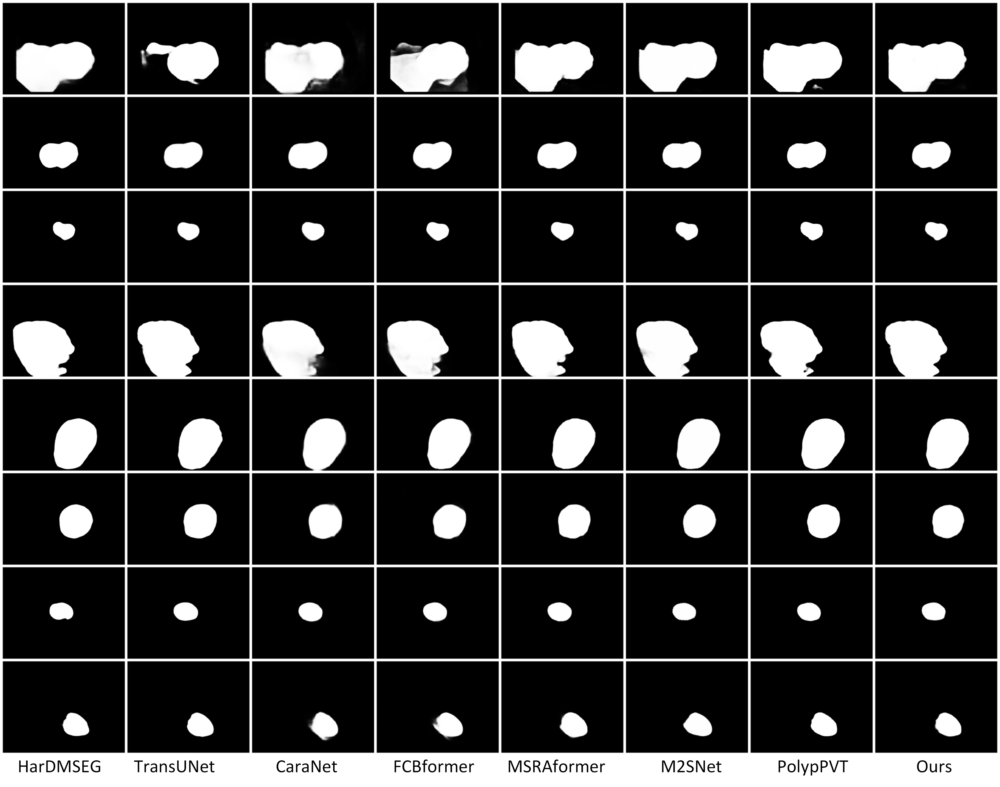

# PolypFormer: A Layer-wise Feature Fusion Transformer for Enhanced Polyp Segmentation

------
Authors: Jin Liu, Dechun Zhao, Hehua Zhang, Keji Zhang 

## 1. Preface
- This repository provides code for "_**A Layer-wise Feature Fusion Transformer for Enhanced Polyp Segmentation (PolypFormer)**_". 

### 1.1. :fire: NEWS :fire:

- [2024/11/9] Release training/testing code.

- [2020/11/2] Create repository.

## 2. Overview

###  2.1. Introduction
Colonoscopy is the gold standard for early screening and prevention of colorectal cancer. Accurate polyp segmentation is crucial for improving diagnostic accuracy and treatment planning. In this work, we introduce PolypFormer, a Transformer network based on layer-wise feature fusion for polyp segmentation. PolypFormer employs a pyramid vision Transformer as the backbone to encode global contextual information and capture multi-level features. A recurrent criss-cross attention module (RCCA) is designed to extract detailed boundary information from lower-level features, while a multi-scale feature fusion perception module (MSFFP) integrates high-level semantic features into the decoder network. Extensive experiments on five public datasets demonstrate that PolypFormer outperforms 14 state-of-the-art methods in both segmentation performance and generalization capability. The proposed approach not only achieves high accuracy in segmenting polyps with varying sizes and shapes but also exhibits robust performance across different datasets.
### 2.2. Framework Overview

      
    <em> 
    Figure 1: Overview of the proposed PolypFormer.
    </em>

### 2.3. Qualitative Results

      
    <em> 
    Figure 2: Qualitative Results.
    </em>

      
    <em> 
    Figure 3: Qualitative Results.
    </em>

## 3. Proposed Baseline

The training and testing experiments are conducted using [PyTorch](https://github.com/pytorch/pytorch) with 

1. Configuring your environment (Prerequisites):

   Note that PolypFormer is only tested on Ubuntu OS with the following environments. It may work on other operating systems as well but we do not guarantee that it will.

   - Creating a virtual environment in terminal: .`conda create -n PolypFormer python=3.9`
   - Installing necessary packages: `PyTorch 1.13`

   2.Downloading necessary data:

- downloading testing dataset and move it into , which can be found in this [download link (Google Drive)](https://drive.google.com/file/d/1lODorfB33jbd-im-qrtUgWnZXxB94F55/view?usp=sharing). It contains five sub-datsets: CVC-300 (60 test samples), CVC-ClinicDB (62 test samples), CVC-ColonDB (380 test samples), ETIS-LaribPolypDB (196 test samples), Kvasir (100 test samples).`./data/TestDataset/`

- downloading training dataset and move it into , which can be found in this [download link  (Google Drive)](https://drive.google.com/file/d/1o8OfBvYE6K-EpDyvzsmMPndnUMwb540R/view?usp=sharing). It contains two sub-datasets: Kvasir-SEG (900 train samples) and CVC-ClinicDB (550 train samples).`./data/TrainDataset/`

- download the weight of pvtv2 form [[PVTv2(Google Drive) ]](https://github.com/whai362/PVT/releases/tag/v2) and move it into

  `pretrained_pth/pvt_v2_b2.pth`

- downloading pretrained weights and move it into `model_pth/`,which can be found in this [download link(提取码：a78y)](https://pan.baidu.com/s/19eb29-nh77Aqjxm5DIaBVg?pwd=a78y )

 

